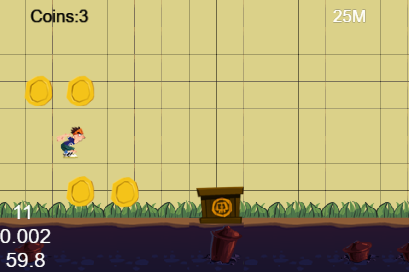
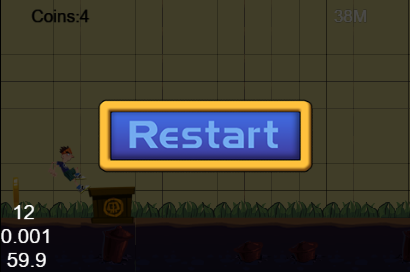

# ParkourCpp

A C++ port of the toy project Parkour in the official [Cocos2d-JS Tutorial](http://cocos2d-x.org/docs/tutorials/javascript/javascript/index.html).

Not finished yet.

## Original Game Screenshots

## Links

* [Cocos2d-x v3.10 API Reference](http://www.cocos2d-x.org/docs/api-ref/cplusplus/V3.10/)
* [Tiled Map Editor](http://www.mapeditor.org/)

### Chipmunk2D
- [Chipmunk2D Physics - Documentation](http://chipmunk-physics.net/documentation.php)
- [cpSpaceAddPostStepCallback](http://chipmunk-physics.net/release/ChipmunkLatest-API-Reference/group__cp_space.html#ga6fbf3c0722a5618ded1ed7371cbebcb3)

### C++
- [Stack Overflow - How do C++ class members get initialized if I don't do it explicitly?](http://stackoverflow.com/questions/3127454/how-do-c-class-members-get-initialized-if-i-dont-do-it-explicitly)
- [Stack Overflow - C++ remove\_if on a vector of objects](http://stackoverflow.com/questions/7958216/c-remove-if-on-a-vector-of-objects)
- std::CONTAINER&lt;POINTERS&gt;
  - [Stack Overflow - std::list of pointers and remove\_if](http://stackoverflow.com/questions/10539972/stdlist-of-pointers-and-remove-if)
  - [Stack Overflow - Can you use \`std::remove\_if\` on a container of \`std::unique\_ptr\`?](http://stackoverflow.com/questions/8415016/can-you-use-stdremove-if-on-a-container-of-stdunique-ptr)
  - [cppreference.com - std::unique\_ptr](http://en.cppreference.com/w/cpp/memory/unique_ptr)
  - [Stack Overflow - Difference between boost::scoped\_ptr&lt;T&gt; and std::unique\_ptr&lt;T&gt;](http://stackoverflow.com/questions/8199812/difference-between-boostscoped-ptrt-and-stdunique-ptrt)

### Further Read
- [cocos2d-x 源码分析 ： Ref （CCObject） 源码分析 cocos2d-x内存管理策略](http://blog.csdn.net/u011225840/article/details/32919969)
- [chipmunk创建和销毁刚体过程](http://blog.csdn.net/hcwzq/article/details/18401789)

*kbridge*
