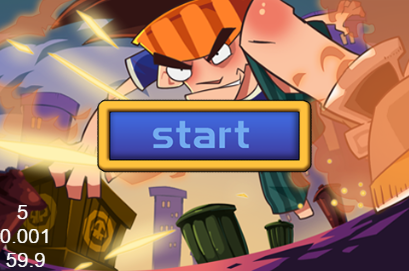

# ParkourCpp

A C++ port of the toy project Parkour in the official [Cocos2d-JS Tutorial](http://cocos2d-x.org/docs/tutorials/javascript/javascript/index.html).

Not finished yet.

## Original Game Screenshots

## Links

* [Cocos2d-x v3.10 API Reference](http://www.cocos2d-x.org/docs/api-ref/cplusplus/V3.10/)

*kbridge*
